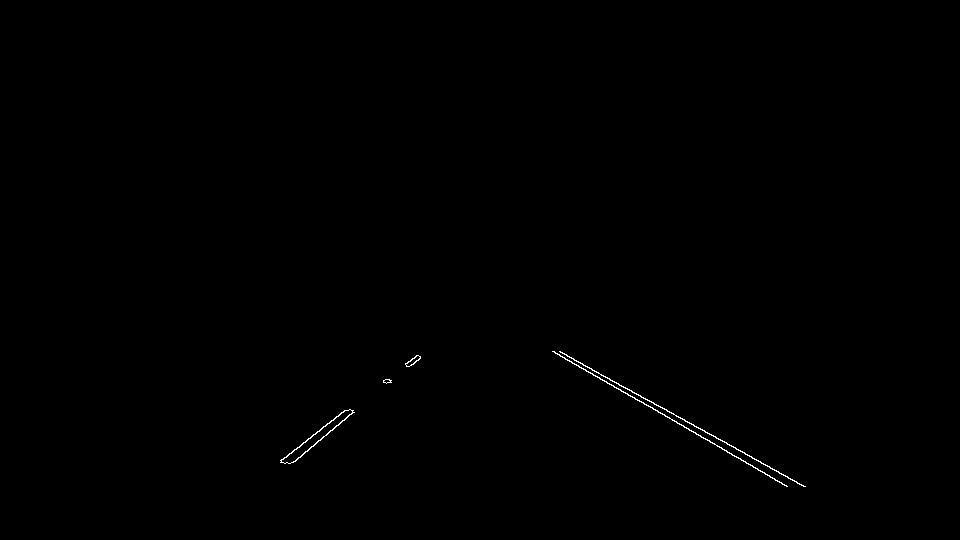

# Self-Driving Car Engineer Nanodegree

## Project 1: **Finding Lane Lines on the Road** 
***
This project focuses on finding lane lines in a video stream using the lessons learned in Udacity Self Driving Nano-Degree Program. 

Objective: detect lane lines in images and video feeds and draw continuous lane lines on the image and video feed for the provided image and video samples, including the challenge video. 

### Tools and references

Codes and references from [Udacity Self Driving Car Nano Degree Program](https://www.udacity.com/course/self-driving-car-engineer-nanodegree--nd013) are used in this project.
Images and video feeds were provided by the course. Ideas and suggestions from the course are used to develop the pipeline.

The following libraries are used to develop the pipeline and illustrate the results:
- Numpy
- Math
- OpenCV
- Matplotlib
- OS
- MoviePy
- IPython

### Description of the lane line detection pipeline:
The pipeline is defined as a class to better manage the outputs and have flexibility to store/display the results.
For every input image to the pipeline, the following steps are sequentially executed:
- Reading the input image
- Grayscaling the image
- Gaussian smoothing to reduce the noise in images
- Canny Edge Detection, 
- Defining region of interest in the image and masking the rest of the image
- Haugh Transform to detect line segments in the region of interest

The following images illustrate the results of each step, respectively:

 

Detected lines are then classified into right and left lines. The classify_lines function appends each line to a "right" or "left" set based on the calculated slope for each line:

#### Improving robustness:

To eliminate outliers, "left" and "right" sets of detected lines are processed using the remove_line_noise function. This function receives a median slope and a tolerance and eliminates the lines that do not fall within the specified slope region.

After filtering, average slope and intercept for the "left" and "right" sets is calculated using the average_line_slope_intercept function.

Finally, the extended left and right lanes are illustrated on the images using the calculated slope/intercept values and algebraic calculations. 

### Testing the pipeline on the image set:

The results for the test images are illustrated below:

### Further improvement of the pipeline for lane line detection in video feeds:

To achieve smooth results when processing video feeds, a buffer of previous slope and intercept values for the right and left lanes is kept in global memory. The buffer gets updated only if the current frame contains detected lines that match the criteria specified in the pipeline.

For every new frame, median of the available slope/intercept including the results for the current frame is chosen as the smoothed slope/intercept. The extended lines to illustrate on the video feed are calculated using smoothed slope and intercept.

### Testing on video feeds
The pipeline is tested on three video feeds with different lane colors, lightnig and road surface and shading conditions.

#### Test Case 1

First, the pipeline is tested on a video with white lane markings:

[White Lane Markings](https://youtu.be/d9RTncq0h4w)

#### Test Case 2

Now for a video with the solid yellow lane on the left. This one's more tricky!

[Yellow Lane Markings](https://youtu.be/SZFrd4xmi54)

##### Test Case 3: Optional Challenge

Now, for a more interesting video feed! Road surface changes, lighting condition and shades makes lane detection more challenging for this case...
Let's see!

[Challenge!](https://youtu.be/J2QgPdEhMZE)

### Potential Shortcomings:

Potential shortcomings of the pipeline include:
-  Canny edge detection faces challenges when the input frame is noisy in terms of shadows, non-homogeneous surface, etc.
- The pipeline only considers straight lane segments. 
- All the test images and videos are relatively well lit. Performance of the pipeline might not be as reliable for other driving conditions.
- Camera position is similar for all of the test images and videos. The pipeline needs to be tuned if the camera position changes.

### Possible Improvements to the Pipeline:

The pipeline can be potentially improved through:
- Considering curved lanes in the calculations, using polynomial coefficients instead of the slope and intercept
- Better filtering and smoothing of the input images
- Using a Kalman filter to consider dynamics of the lane markings in the video feeds, filtering the results and achieving a smoother performance for more challenging conditions

